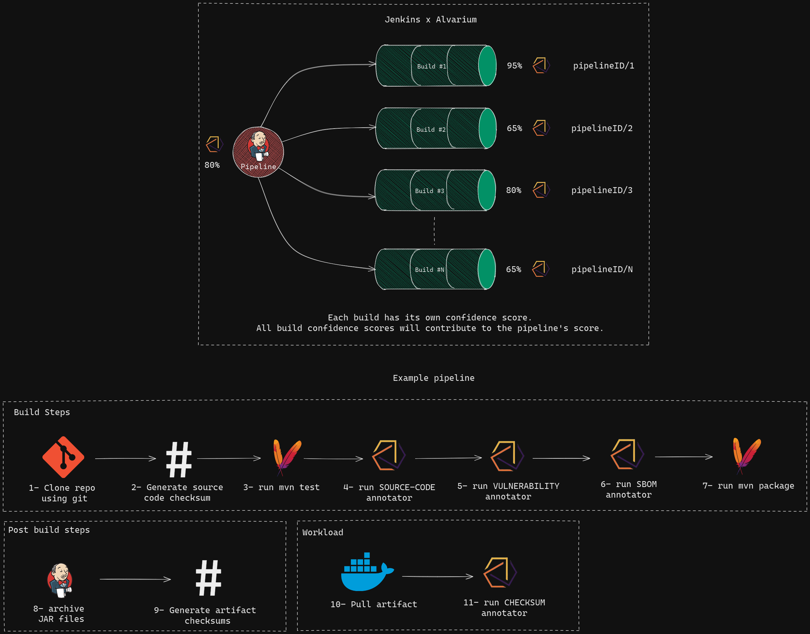

# Alvarium Pipelines Shared Library
This library is built using the [Alvarium Java SDK](https://github.com/project-alvarium/alvarium-sdk-java) and contains useful library functions to support capturing events during the execution of a Jenkins pipeline and publishing alvarium annotations designed for jenkins pipelines to provide confidence to the CI/CD process.



> For source-code, dependency vulnerability, and artifact checksum confidence, the relevant annotation keys become the value of the pipeline name and the build number separated by "/" (e.g., "hello-world-pipeline/20")
>
> ℹ️ The methodology of which this pipeline is designed accordingly is that the first Alvarium SDK call is a `create()` method. And all subsequent calls are `transit()`. 

# Getting Started
## Alvarium Configuration
The [Config File Provider](https://plugins.jenkins.io/config-file-provider) plugin is used to provide configuration files to the alvarium SDK. After the plugin is installed, create a new configuration file from **Manage Jenkins > Managed Files > Add new config > Json file** and set the **ID** as `alvarium-config`. 

**Example configuration**

> Ensure that public and private keys are present at the paths provided in `signature.public.path` and `signature.private.path`. See https://github.com/project-alvarium/example-java/tree/main/src/main/resources for examples.
>
> ⚠️
> The library currently only supports "source-code", "checksum", "sbom", and "vulnerability" annotators... Support for conventional alvarium annotators may be added at a later stage.


```jsonc
{
  "annotators": [
    {
      "kind": "source-code"
    },
    {
      "kind": "sbom",
      "type": "spdx",
      "version": "SPDX-2.2"
    }
    {
      "kind": "checksum"
    },
    {
      "kind": "vulnerability",
      "type": "osv",
      "paths": {
        "queryBatch": "/v1/querybatch",
        "query": "/v1/query"
      },
      "provider": {
        "host": "api.osv.dev",
        "port": 443,
        "protocol": "https"
      }
    }
  ],
  "hash": {
    "type": "md5"
  },
  "signature": {
    "public": {
      "type": "ed25519",
      "path": "/home/public.key" 
    },
    "private": {
      "type": "ed25519",
      "path": "/home/private.key"
    }
  },
  "stream": {
    "type": "mqtt",
    "config": {
      "clientId": "alvarium-test",
      "qos": 0,
      "user": "",
      "password": "",
      "provider": {
        "host": "localhost",
        "protocol": "tcp",
        "port": 1883
      },
      "cleanness": false,
      "topics": ["alvarium-test-topic"]
    }
  }
}
```

> Not similar to the Alvarium SDKs behavior, the annotators specified in the configuration are not all used for each SDK method called, but used as a reference for the SDK to use when being initialized. Only the annotator's passed in the library's function parameters is used.

## Adding to Jenkins
See the Jenkins docs on [Using Shared Libraries](https://www.jenkins.io/doc/book/pipeline/shared-libraries/) on how to add to the Jenkins instance. Testing was done by adding the library to the `${JENKINS_URL}/configure` page on the Jenkins instance.


Then by adding the following line on top of the Jenkinsfile
```groovy
@Library('alvarium-pipelines@main') _
```

## Usage

### **alvariumCreate(List<String> annotatorKinds, Map<String, String> optionalParameters)**
### **alvariumTransit(List<String> annotatorKinds, Map<String, String> optionalParameters)**

Executes the passed annotators and instantiates an instance of the Alvairum Java SDK to publish them using the `Sdk.create()` or `Sdk.transit()` methods and sets the annotation key as the string `{pipelineID}/{buildNo}`

**`List<String> annotatorKinds`**: takes a list of annotator names identical to the format used in Alvarium configs that will be executed. The method will throw an error if there is no configuration entry for the annotator in the configuration file.

**`Map<String,String> optionalParameters=[:]`**: Supports optional parameters (`artifactPath`, `checksumPath`, `sourceCodeChecksumPath`, `sbomPath`)

- `artifactPath`: Only required when "checksum" annotator is passed in the `annotatorKinds` list and will throw an error if not present when required by the "checksum" annotator. This parameter is used to locate the artifact.

- `checksumPath`: Used to locate the artifact checksum, default value if not provided is `"\${JENKINS_HOME}/jobs/\${JOB_NAME}/\${BUILD_NUMBER}/\${artifactName}.checksum"`

- `sourceCodeChecksumPath`: Used to locate the source code checkusm, default value if not provided is `"${JENKINS_HOME}/${JOB_NAME}/${BUILD_NUMBER}/checksum"`

- `sbomPath`: The location of the SBoM file that the build components are validated against

### **alvariumMutate(List<String> annotatorKinds, Map<String, String> optionalParameters, byte[] newData)**
Executes the passed annotators and instantiates an instance of the Alvairum Java SDK to publish them using the `Sdk.mutate()` method and sets the source annotation (represents lineage) key as the string `{pipelineID}/{buildNo}` and the new data key using `byte[] newData`. **Currently the use-case for this method in a pipeline is not well-defined and will probably have no use.

### Here is an example Jenkinsfile that can be used to build the alvarium Java SDK

```Jenkinsfile
@Library('alvarium-pipelines@main') _

pipeline {
    agent any
    tools {
        maven 'M3'
    }
    stages {
        stage('prep - generate source code checksum') {
            steps {
                sh 'mkdir -p $JENKINS_HOME/jobs/$JOB_NAME/$BUILD_NUMBER/'
                sh '''find . -type f -exec md5sum {} + |\
                        md5sum |\
                        cut -d" " -f1 \
                        > $JENKINS_HOME/jobs/$JOB_NAME/$BUILD_NUMBER/sc_checksum
                '''
            }
        }

        stage('test') {
            steps {
                sh 'mvn test'
            }
            post {
                success {
                    junit 'target/surefire-reports/**/*.xml'
                }
            }
        }

        stage('alvarium - pre-build annotations') {
            steps {
              script{
                def optionalParams = [
                  'sourceCodeChecksumPath':"${JENKINS_HOME}/jobs/${JOB_NAME}/${BUILD_NUMBER}/sc_checksum",
                  'sbomPath': "${WORKSPACE}/sbom.spdx.json"
                ]
                alvariumCreate(['source-code', 'vulnerability', 'sbom'], optionalParams)
              }
            }
        }

        stage('build') {
            steps {
                sh 'mvn package'
            }
            post {
                success {
                    archiveArtifacts artifacts: 'target/**/*.jar', fingerprint: true

                    // Generate artifact checksums
                    sh ''' for f in target/*.jar;
                    do
                        mkdir -p $JENKINS_HOME/jobs/$JOB_NAME/$BUILD_NUMBER/
                        md5sum $f | cut -d ' ' -f 1 | tr 'a-z' 'A-Z' | tr -d '\n' \
                            > $JENKINS_HOME/jobs/$JOB_NAME/$BUILD_NUMBER/$(basename $f).checksum
                    done
                    '''

                    // Check if artifact has a valid checksum... Ideally this
                    // should be done by whatever is pulling the artifact but
                    // alvarium currently has no way of persisting information
                    // relating to annotator logic, which is why the checksum is
                    // being fetched from the file system instead of a persistent
                    // store
                    // TODO (Ali Amin): Find a way to persist the checksum
                    script {
                        def artifactChecksum = readFile "/${JENKINS_HOME}/jobs/${JOB_NAME}/${BUILD_NUMBER}/alvarium-sdk-1.0-SNAPSHOT.jar.checksum"
                        def optionalParams = [
                            "artifactPath":"${WORKSPACE}/target/alvarium-sdk-1.0-SNAPSHOT.jar",
                            "checksumPath": "/${JENKINS_HOME}/jobs/${JOB_NAME}/${BUILD_NUMBER}/alvarium-sdk-1.0-SNAPSHOT.jar.checksum"
                        ]
                        alvariumTransit(['checksum'], optionalParams, artifactChecksum.bytes)
                    }   
                }
            }
        }
    }
}

```

